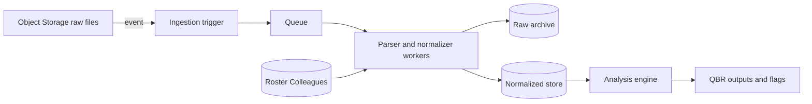

## Introduction

This project designs an automated AI Agent system and delivers a lightweight PoC and documentation to support the creation of Quarterly Business Reviews from project email communication. The primary goal is to detect and surface attention-worthy issues, especially problems, risks, and hidden bottlenecks across long, multi-thread email chains.

## 1. Data Ingestion & Initial Processing

### What we ingest
The input folder contains:
- **Colleagues.txt**: a file of the workers containing the details of **name / role / email**, used for mapping names to roles and email addresses.
- **email1.txt, email2.txt**, …: email thread exports where multiple messages appear in one file, separated by repeated header blocks (From/To/Cc/Date/Subject) followed by the body of the message. 

---

### Scalable ingestion approach
For production scale, I would use an object-storage + event-driven pipeline:
1. **Landing zone**: store incoming files in S3/GCS/Azure Blob under `.../<tenant>/<project>/<date>/...` and compute a content hash (if the hash already exists, the process stops).
2. **Trigger + queue**: storage events enqueue `{object_uri, hash, tenant_id/project_id}` into SQS/PubSub.
3. **Stateless workers**: horizontally scaled parser workers consume the queue and process files by type:
   - **Colleagues.txt** → roster parser
   - **email*.txt** → thread parser (split into messages, parse headers/body)
4. **Storage layers**:
   - **raw archive** (for audit/debug)
   - **normalized store** (e.g. Postgres, Warehouse ) for analysis.

---

### Initial processing 

**A) Roster parsing (`Colleagues.txt`)**
- Parse into `{email → (name, role)}` lookup for enrichment.

**B) Email parsing (`email*.txt`)**
- **Message segmentation**: split by repeated header anchors (e.g., \nFrom:).
- **Header normalization**: extract `from/to/cc/date/subject`, convert date to **UTC** (if needed), normalize subject for grouping.
- **Body cleaning**: remove/mark quoted replies/signatures, normalize whitespace.
- **Enrichment**: join participants with roster to attach roles (when present).
- **Noise tagging**: optionally tag clearly off-topic content.

**Finalized Data stored per message:**
`thread_id, source_file, timestamp_utc, subject_norm, from_email, to[], cc[], body_clean, from_role(optional), hash`

---

### Diagram (high-level)


## 2. The Analytical Engine (Multi-Step AI Logic)

```mermaid
flowchart LR
  A["Parse email*.txt into messages"] --> B["Build full thread_text with [MSG 1..N]"]
  B --> C["Step 1: Draft issues (AI)- deduplicate- classify A/B- evidence quotes + rationale"]
  C --> D["Step 2: Resolution adjudication (AI)- resolved/unresolved/unknown- resolution proof quotes"]
  D --> E["Deterministic guardrails- quotes must exist- resolution must be later"]
  E --> F["Attention Flags output- keep only unresolved/unknown"]
  F --> G["Step 3: Executive summary (AI)- short, actionable- references evidence IDs"]
  G --> H["Artifacts: report.json + report.md"]
  ```

### Step 1 — Issue drafting (AI: `ANALYZE_MODEL`, default `gpt-4o-mini`)

- **Input:** full thread (`thread_text`)
- **Output (structured):** a **deduplicated** list of issues (Flag A or Flag B), each with:
  - `severity_or_priority` (`low` / `medium` / `high`)
  - `evidence_quotes` (1–3 **verbatim** quotes)
  - short rationale (“why A/B and why level”)
- **Why this model:** this is a **high-volume extraction** task, so we use a cost-efficient model with deterministic settings (`temperature=0`).
- **Why structured outputs:** we use Pydantic schemas via `with_structured_output(...)` so the model must return predictable JSON (reduces parsing errors and “creative” answers).

---

### Step 2 — Resolution adjudication (AI: `RESOLVE_MODEL`, default `gpt-4o-mini`)

For **each drafted issue**:

- **Input:** full thread + the issue JSON + optional “resolution snippets”
- **Output (structured):** `status ∈ {resolved, unresolved, unknown}` plus:
  - `resolution_quotes` (1–3 **verbatim** quotes proving resolution)
  - short rationale (“why resolved/unresolved/unknown”)
- **Why a second model call?**  
  Deciding “resolved later” is a **separate reasoning task** that benefits from being isolated and forced to produce **explicit proof** (quotes). This reduces false “still open” cases (e.g., when the fix is confirmed only at the end).

---

### Step 2b — Guardrails (deterministic checks, anti-hallucination)

We enforce rules **outside** the LLM:

- **Quote existence check:** both evidence and resolution quotes must be exact substrings of `thread_text`.
- **Chronology check:** resolution quotes must appear in a later `[MSG k]` than the problem evidence.
- If the model claims `resolved` but fails these checks → downgrade to `unknown`.

---

### Step 3 — Executive summary (AI: `SUMMARY_MODEL`, default `gpt-5-mini`)

- **Input:** only `unresolved` / `unknown` items + an evidence map `{E# → quote}`
- **Output:** a short Director-friendly markdown summary grouped by Flag A vs Flag B, referencing evidence IDs like `[E3]`.
- **Why a stronger summary model?**  
  Summaries are what leadership reads; we prefer higher output quality here while keeping extraction/adjudication cost-efficient.

---

### Model routing and cost control

All model choices are configurable by environment variables:

- `OPENAI_ANALYZE_MODEL` (default: `gpt-4o-mini`)
- `OPENAI_RESOLVE_MODEL` (default: `gpt-4o-mini`)
- `OPENAI_SUMMARY_MODEL` (default: `gpt-5-mini`)

This allows cost/performance tuning without code changes.

### Engineered prompts used in the code (full text + intent)

This PoC uses **three prompt pairs** (System + User) aligned to the three AI steps:
- **Draft** (extract + deduplicate + classify issues)
- **Resolve** (decide if each issue was resolved later in the thread, with proof)
- **Summarize** (Director-ready output, grounded in evidence IDs)

Each step is separated to keep the model’s job narrow and measurable, and to enforce *grounding* via verbatim quotes.

---

#### 1) Issue drafting prompts (`THREAD_SYSTEM` + `THREAD_USER`)

**Goal:** From the full email thread, produce a **deduplicated** list of issues, labeled as Flag A or Flag B, each backed by **verbatim evidence quotes**.

```text
THREAD_SYSTEM:
You are a Director-level QBR analyst for project delivery email threads.
Return ONLY issues supported by verbatim quotes from the provided thread.
IMPORTANT: NO duplicates — merge repeated mentions of the same incident into ONE issue.
Do not guess.

THREAD_USER:
Analyze the full email thread and return a deduplicated list of issues.

Definitions:
- Attention Flag A_unresolved_action_item: explicit asks/questions/tasks/decisions needed.
- Attention Flag B_emerging_risk_blocker: blockers/incidents/risks (prod issues, outages, scope/timeline risks, etc.).

Rules (strict):
1) NO duplicates: merge repeated mentions of the same incident/task into one issue.
2) severity_or_priority: low|medium|high (use high only for explicit cues like URGENT, panic, prod/live impact, "all hands").
3) evidence_quotes: 1-3 short verbatim quotes that demonstrate the PROBLEM / ASK.
4) rationale_flag_level: 1-2 sentences explaining why it’s A or B and why the level.

THREAD (verbatim):
{thread_text}
```

**Design notes (why it works):**
- “NO duplicates” forces thread-level merging, not message-by-message extraction.
- Evidence quotes are required, so output stays grounded in the source.

---

#### 2) Resolution adjudication prompts (`RESOLVE_SYSTEM` + `RESOLVE_USER`)

**Goal:** For each drafted issue, decide if it was resolved later by the end of the thread, even if the word “resolved” is not used. If resolved, require **verbatim resolution proof quotes**.

```text
RESOLVE_SYSTEM:
You are a strict resolution adjudicator.
Your job is to decide if the issue is RESOLVED later in the thread.
Use contextual proof (e.g., 'fix is out', 'tested', 'working again').
Do not guess: if there is no clear proof, set status='unknown' or 'unresolved'.

RESOLVE_USER:
Decide whether the issue is resolved by the END of the thread.

Inputs:
- THREAD (verbatim)
- ISSUE (title + flag + level + problem evidence quotes)
- OPTIONAL: candidate_resolution_snippets (machine-selected snippets that may indicate resolution)

Rules (strict):
1) status must be one of: resolved|unresolved|unknown.
2) If status=resolved, you MUST provide 1-3 resolution_quotes copied verbatim from the thread that show:
   - a fix was applied/deployed OR completion happened AND
   - confirmation/verification (e.g., tested, working again) when available.
3) resolution_quotes should come from later messages than the problem evidence (chronologically).
4) rationale_status: 1-2 sentences explaining why you chose the status.

THREAD:
{thread_text}

ISSUE_JSON:
{issue_json}

CANDIDATE_RESOLUTION_SNIPPETS (may be empty):
{candidate_snippets}
```

**Design notes (why it works):**
- Requires explicit proof (`resolution_quotes`), which reduces “guessing”.
- The code further enforces chronology outside the LLM (resolution proof must appear in a later `[MSG k]`).

---

#### 3) Executive summary prompts (`SUMMARY_SYSTEM` + `SUMMARY_USER`)

**Goal:** Generate a short Director-friendly summary using only unresolved/unknown items, referencing evidence IDs for auditability.

```text
SUMMARY_SYSTEM:
You write concise executive summaries for Directors.
Use only the provided unresolved/unknown items.
Do not invent facts.

SUMMARY_USER:
Create a Portfolio Health summary.

Rules:
- Group by Attention Flag A and B.
- Include only items with status='unresolved' and 'unknown' (unknown -> needs clarification).
- Each bullet MUST reference evidence IDs like [E1], [E2] (can be multiple).
- Keep it short and actionable.

PAYLOAD_JSON:
{payload_json}
```

**Design notes (why it works):**
- Prevents scope creep by only summarizing items already selected by the engine.
- Evidence IDs make the summary traceable back to exact quotes in the report.

## 3. Cost & Robustness Considerations

### 3.1 Robustness (resilience to misleading / ambiguous information)

- **Evidence-grounded extraction:** every issue must include **1–3 verbatim quotes** from the thread (`evidence_quotes`). If a quote is not found verbatim in `thread_text`, the item is discarded (**hard guardrail**).
- **Structured outputs (fixed schema):** all AI steps use LangChain `with_structured_output(...)` with Pydantic schemas, reducing misinformation / “creative” responses and making validation deterministic.
- **Separate “resolution adjudication” step:** resolution is decided in an isolated step that must output `status ∈ {resolved, unresolved, unknown}` and, if categorized as **resolved**, the system requires **explicit resolution quotes**, pushing the model away from guessing.
- **Chronology enforcement:** if the model claims `resolved`, the code enforces that resolution quotes appear **later** than the problem evidence; otherwise it is downgraded to `unknown`.
- **Uncertainty is a feature:** ambiguous cases are intentionally labeled `unknown` so they can be surfaced for human clarification instead of being hallucinated into “resolved/unresolved”.

### 3.2 Cost management (AI usage strategy)

- **Model routing / cascading:** use a cheap, fast model for high-volume steps (**draft + resolve**) and reserve the stronger (more expensive) model only for the final **executive summary**.
- **Token minimization:**
  - analyze at **thread-level once** (deduplicated), not per-message;
  - generate the summary only from **unresolved/unknown** items, not the full thread;
  - keep quotes short (1–3, ~1 line each).
- **Caching + reuse where possible:** for repeated runs on the same emails, cache per-thread results keyed by a content hash (reduces repeated LLM calls; may benefit from cached-input pricing where supported).
- **Configurable cost controls:** models are set via env vars (`OPENAI_ANALYZE_MODEL`, `OPENAI_RESOLVE_MODEL`, `OPENAI_SUMMARY_MODEL`) so we can tune cost/performance without code changes and align with current pricing.

## 4. Monitoring & Trust

### 4.1 How we keep it accurate and trustworthy

- **Grounding + auditability by design:** every extracted issue must carry **verbatim evidence quotes** with evidence IDs, so a it can be quickly verified in the original thread.
- **Automated evaluation on a test set:** maintain a small but representative labeled dataset of threads (expected issues, flags, severity, resolved status). Run it:
  - on every prompt/model change (CI),
  - on a schedule (daily/weekly),
  - and as canary checks in production.
- **Online observability / traceability:** log (non-sensitive) traces per run: model versions, prompt versions, schema validation results, and evidence IDs with tools like LangSmith-style tracing (makes it easy to debug regressions and compare variants).
- **Human-in-the-loop for edge cases:** route `status=unknown` and low-confidence cases to review; use those reviewed examples to expand the test set (continuous improvement loop).
- **Drift detection:** monitor shifts in input data (email length, languages, topic distribution) and output distribution (more “unknown”, fewer issues, severity changes) and trigger re-evaluation when distributions change significantly.

### 4.2 Key metrics to track

**Quality / correctness**
- **Faithfulness / grounding rate:** % of outputs where all evidence quotes are present and support the claim (or LLM-as-judge “faithfulness”).
- **Issue precision & recall (test set):** false positives (noise flagged as risk) vs missed critical risks.
- **Resolution accuracy:** % correct `resolved/unresolved/unknown` vs labeled truth (especially important for “resolved later” logic).
- **Duplicate rate:** % of threads where the system emits semantically duplicate issues (should be near zero).
- **Unknown rate:** % of issues marked `unknown` (too high → model uncertainty; too low → likely overconfidence/hallucination).

**Reliability / ops**
- **Schema validation failure rate:** structured-output parsing errors, retries, fallbacks.
- **End-to-end latency:**  runtime per thread.
- **Error rate & rate-limit events:** API failures, timeouts, backoff/retry counts.

**Cost**
- **Tokens and cost per thread / per run:** input/output tokens by step (draft/resolve/summary), plus monthly cost trend.
- **Cache hit rate:** % of threads served from cached results (when re-running on unchanged data).
- **Cost per “useful item”:** cost divided by number of unresolved/unknown items surfaced (helps justify spend).

## 5. Architectural Risk & Mitigation

### Biggest architectural risk: **Prompt injection / untrusted input influencing the LLM**
Even in this simplified system, the LLM is processing **untrusted text** (email bodies). A malicious or misleading message can “instruct” the model to ignore rules, hide issues, or mislabel resolution. 
This is especially risky because leadership-facing outputs can be materially impacted by a single manipulated thread.

### Mitigation strategy
- **Treat the LLM as an untrusted component:** never allow model output to directly trigger actions; outputs must remain “recommendations” backed by evidence.
- **Hard grounding requirements (already implemented):**
  - every issue must include **verbatim evidence quotes**;
  - “resolved” requires **verbatim resolution quotes**;
  - deterministic checks enforce quotes exist and resolution appears **later** than the problem evidence.
- **Instruction/data separation:** make the prompt explicit that the *thread is data, not instructions*, and refuse to follow any instructions found in emails. 
- **Least-privilege runtime:** keep the analyzer isolated (no access to secrets, no external tools, no write actions beyond report generation), so even a successful injection has minimal blast radius.
- **Sensitive-data controls:** apply redaction/DLP before model calls and use vendor settings that avoid training on business inputs by default; this reduces the impact of accidental leakage in prompts/outputs. 