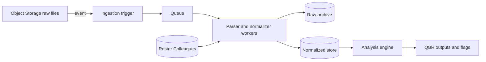

## Introduction

This interview project designs an automated AI Agent system and delivers a lightweight PoC and documentation to support the creation of Quarterly Business Reviews from project email communication. The primary goal is to detect and surface attention-worthy issues, especially problems, risks, and hidden bottlenecks across long, multi-thread email chains.

## 1. Data Ingestion & Initial Processing

### What we ingest
The input folder contains:
- **Colleagues.txt**: a file of the workers containing the details of **name / role / email**, used for mapping names to roles and email addresses.
- **email1.txt, email2.txt**, …: email thread exports where multiple messages appear in one file, separated by repeated header blocks (From/To/Cc/Date/Subject) followed by the body of the message. 

---

### Scalable ingestion approach
For production scale, I would use an object-storage + event-driven pipeline:
1. **Landing zone**: store incoming files in S3/GCS/Azure Blob under `.../<tenant>/<project>/<date>/...` and compute a content hash (if the hash already exists, the process stops).
2. **Trigger + queue**: storage events enqueue `{object_uri, hash, tenant_id/project_id}` into SQS/PubSub.
3. **Stateless workers**: horizontally scaled parser workers consume the queue and process files by type:
   - **Colleagues.txt** → roster parser
   - **email*.txt** → thread parser (split into messages, parse headers/body)
4. **Storage layers**:
   - **raw archive** (for audit/debug)
   - **normalized store** (e.g. Postgres, Warehouse ) for analysis.

---

### Initial processing 

**A) Roster parsing (`Colleagues.txt`)**
- Parse into `{email → (name, role)}` lookup for enrichment.

**B) Email parsing (`email*.txt`)**
- **Message segmentation**: split by repeated header anchors (e.g., \nFrom:).
- **Header normalization**: extract `from/to/cc/date/subject`, convert date to **UTC** (if needed), normalize subject for grouping.
- **Body cleaning**: remove/mark quoted replies/signatures, normalize whitespace.
- **Enrichment**: join participants with roster to attach roles (when present).
- **Noise tagging**: optionally tag clearly off-topic content.

**Finalized Data stored per message:**
`thread_id, source_file, timestamp_utc, subject_norm, from_email, to[], cc[], body_clean, from_role(optional), hash`

---

### Diagram (high-level)


## 2. The Analytical Engine (Multi-Step AI Logic)

### Step 1 — Issue drafting (AI: `ANALYZE_MODEL`, default `gpt-4o-mini`)

- **Input:** full thread (`thread_text`)
- **Output (structured):** a **deduplicated** list of issues (Flag A or Flag B), each with:
  - `severity_or_priority` (`low` / `medium` / `high`)
  - `evidence_quotes` (1–3 **verbatim** quotes)
  - short rationale (“why A/B and why level”)
- **Why this model:** this is a **high-volume extraction** task, so we use a cost-efficient model with deterministic settings (`temperature=0`).
- **Why structured outputs:** we use Pydantic schemas via `with_structured_output(...)` so the model must return predictable JSON (reduces parsing errors and “creative” answers).

---

### Step 2 — Resolution adjudication (AI: `RESOLVE_MODEL`, default `gpt-4o-mini`)

For **each drafted issue**:

- **Input:** full thread + the issue JSON + optional “resolution snippets”
- **Output (structured):** `status ∈ {resolved, unresolved, unknown}` plus:
  - `resolution_quotes` (1–3 **verbatim** quotes proving resolution)
  - short rationale (“why resolved/unresolved/unknown”)
- **Why a second model call?**  
  Deciding “resolved later” is a **separate reasoning task** that benefits from being isolated and forced to produce **explicit proof** (quotes). This reduces false “still open” cases (e.g., when the fix is confirmed only at the end).

---

### Step 2b — Guardrails (deterministic checks, anti-hallucination)

We enforce rules **outside** the LLM:

- **Quote existence check:** both evidence and resolution quotes must be exact substrings of `thread_text`.
- **Chronology check:** resolution quotes must appear in a later `[MSG k]` than the problem evidence.
- If the model claims `resolved` but fails these checks → downgrade to `unknown`.

---

### Step 3 — Executive summary (AI: `SUMMARY_MODEL`, default `gpt-5-mini`)

- **Input:** only `unresolved` / `unknown` items + an evidence map `{E# → quote}`
- **Output:** a short Director-friendly markdown summary grouped by Flag A vs Flag B, referencing evidence IDs like `[E3]`.
- **Why a stronger summary model?**  
  Summaries are what leadership reads; we prefer higher output quality here while keeping extraction/adjudication cost-efficient.

---

### Model routing and cost control

All model choices are configurable by environment variables:

- `OPENAI_ANALYZE_MODEL` (default: `gpt-4o-mini`)
- `OPENAI_RESOLVE_MODEL` (default: `gpt-4o-mini`)
- `OPENAI_SUMMARY_MODEL` (default: `gpt-5-mini`)

This allows cost/performance tuning without code changes.

```mermaid
flowchart LR
  A["Parse email*.txt into messages"] --> B["Build full thread_text with [MSG 1..N]"]
  B --> C["Step 1: Draft issues (AI)\n- deduplicate\n- classify A/B\n- evidence quotes + rationale"]
  C --> D["Step 2: Resolution adjudication (AI)\n- resolved/unresolved/unknown\n- resolution proof quotes"]
  D --> E["Deterministic guardrails\n- quotes must exist\n- resolution must be later"]
  E --> F["Attention Flags output\n- keep only unresolved/unknown"]
  F --> G["Step 3: Executive summary (AI)\n- short, actionable\n- references evidence IDs"]
  G --> H["Artifacts: report.json + report.md"]
  ```


